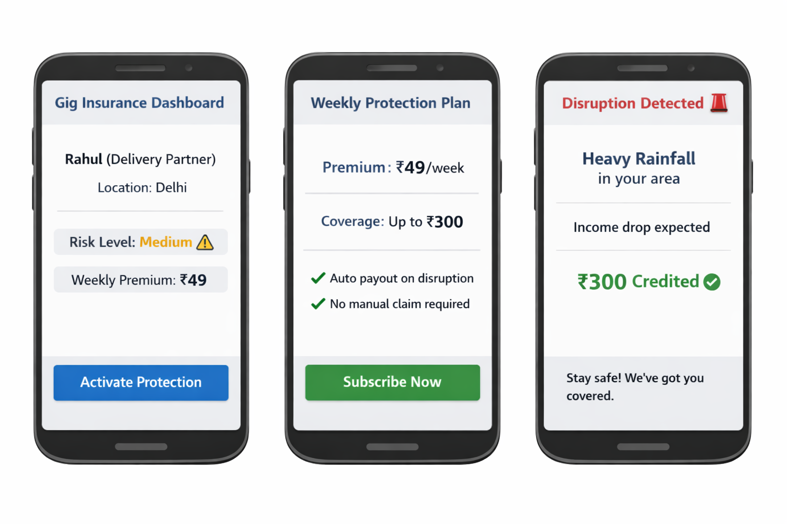

# DevTrails Gig Insurance  
AI-driven platform protecting gig workers from income loss due to real-world disruptions.

## Persona & Requirement

We are targeting **gig workers**, specifically Q-commerce delivery partners such as **Blinkit**.

These workers typically earn around **₹500–₹1000 per day** and rely entirely on completing deliveries for their income. Their earnings are highly unstable and directly affected by external factors such as weather conditions, pollution, and other real-world disruptions.

### Example:
During heavy rainfall, delivery demand drops significantly, leading to a **30–40% reduction in daily income**, and in extreme cases, even a **100% loss of income** for that period.

Currently, there is **no existing solution** that provides financial protection for gig workers against such income loss caused by external disruptions.

Our goal is to design a system that provides **income protection for gig workers during such events**.

---

## Workflow

1. The user registers on the platform by providing details such as location, working hours, and their delivery platform.  
2. The system analyzes external data such as AQI levels, weather conditions, and other factors to calculate the user's risk profile.  
3. Based on this risk, the system suggests suitable weekly premium plans.  
4. The user selects and subscribes to a weekly insurance policy.  
5. The system continuously monitors real-time data through APIs.  
6. When a parametric trigger is detected, the system identifies potential income loss.  
7. Payout is automatically initiated without requiring any manual claim.  

---

## Weekly Premium Model

Our platform uses a **risk-based weekly premium model** that is simple and flexible.

Instead of forcing a fixed premium, the system first calculates the **risk level** of the user based on location and external conditions.

Based on this, users are offered **three plan options**:

| Plan Type | Coverage |
|----------|----------|
| Basic Plan | Low payout |
| Standard Plan | Medium payout |
| Premium Plan | High payout |

### Key Idea:
- The system **calculates the risk**, but the **user chooses the plan**  
- Users in high-risk areas can still select a lower plan  
- However, payout will be **proportional to the selected plan**

### Basic Motto:
Workers pay a small weekly amount, and in return, they are protected from sudden income loss caused by real-world disruptions.

---

## Parametric Triggers

Payouts are not manual — they are triggered automatically based on real-world conditions.

If conditions such as **heavy rainfall, extreme pollution, or other disruptions** cross a predefined threshold, the system assumes income loss and triggers payout.

---

## Payout Mechanism (Event-Based)

Payout is **event-based**, not time-based.

A worker receives payout only when:
- Disruption occurs  
- Worker is active  
- Policy is active  

If no disruption happens, no payout is made.

---

## Platform Choice 

We will use a **mobile-first approach**, as delivery partners are usually active on mobile.

Mobile apps allow:
- Real-time updates  
- Better location tracking  

---

## AI & Fraud Detection

### AI Usage:
- Predicts risk based on weather and location  
- Dynamically adjusts premium suggestions  

### Fraud Handling (Market Crash ):

- Cross-checking GPS data with activity  
- Detecting inactive users attempting to claim payout  
- Identifying multiple sudden claims from the same area  
- Flagging suspicious patterns instead of directly rejecting claims  

---

## Tech Stack

- Frontend : React  
- Backend  : Node.js  
- Database : MongoDB  
- AI/ML    : Python (Scikit-learn)  
- Payments : Razorpay  

## Prototype

